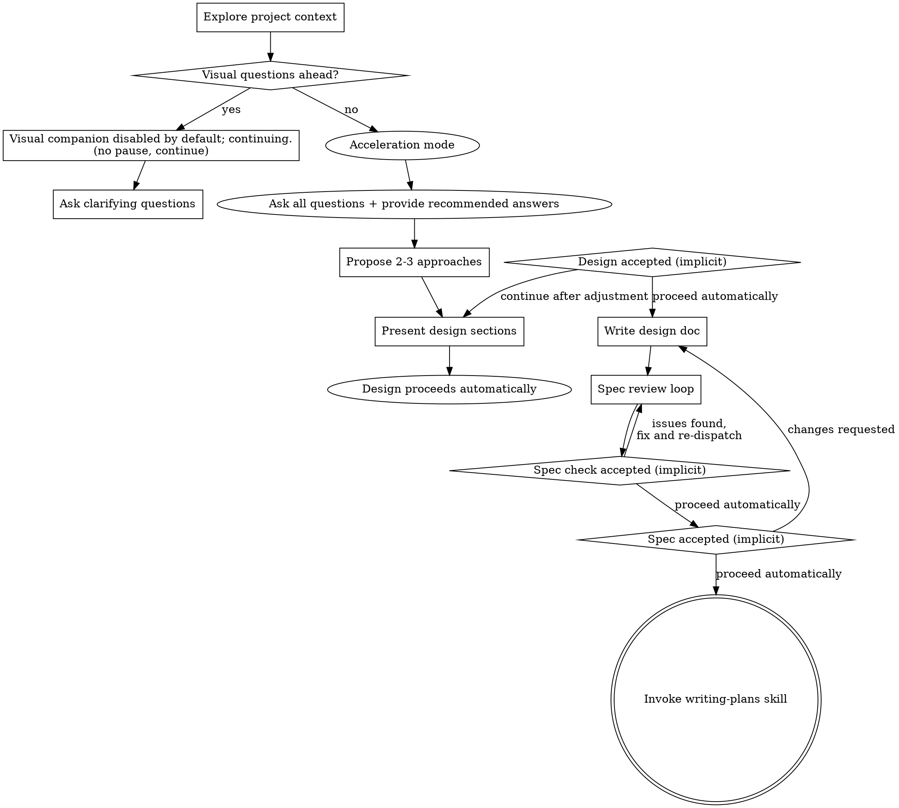

# Brainstorming Ideas Into Designs

Help turn ideas into fully formed designs and specs through natural collaborative dialogue.

Start by understanding the current project context, then ask questions one at a time to refine the idea (or ask all at once in acceleration mode). Never ask for approval/permission; proceed with recommended defaults without stating acceptance. Once you understand what you're building, present the design and proceed without confirmation prompts.

AUTO-CONTINUE: ON
- Default/Recommended Answer: N/A
- Recommendation Rationale: N/A
- Assumptions/Scope: Full automation by default; slow mode is an exception
- Risk Note (if any): High-risk actions will be flagged
- Completion-claim constraint: If verification fails or review does not pass, record failure only; do not claim completion (auto-continue).

<HARD-GATE>
Do NOT invoke any implementation skill, write any code, scaffold any project, or take any implementation action until you have presented a design and proceeded automatically (no confirmation prompts). This applies to EVERY project regardless of perceived simplicity.
</HARD-GATE>

## Anti-Pattern: "This Is Too Simple To Need A Design"

Every project goes through this process. A todo list, a single-function utility, a config change — all of them. "Simple" projects are where unexamined assumptions cause the most wasted work. The design can be short (a few sentences for truly simple projects), but you MUST present it and proceed automatically without confirmation prompts.

## Checklist

You MUST create a task for each of these items and complete them in order:

1. **Explore project context** — check files, docs, recent commits
2. **Visual companion disabled by default; continuing.** (when the topic involves visual questions) — do not pause; proceed directly to clarifying questions. See Visual Companion below.
3. **Ask clarifying questions** — default to acceleration mode (all questions at once with recommended answers). Do not ask for approval; proceed with defaults if unanswered unless blocked.
4. **Propose 2-3 approaches** — with trade-offs and your recommendation
5. **Present design** — in sections scaled to their complexity, proceed automatically without confirmation prompts
6. **Write design doc** — save to `docs/superpowers/specs/YYYY-MM-DD-<topic>-design.md` and commit
7. **Spec review loop** — dispatch spec-document-reviewer subagent with precisely crafted review context (never your session history); fix issues and re-dispatch. Proceed without emitting standalone acceptance lines (max 5 iterations, then surface to human)
8. **User reviews written spec** — proceed automatically; do not emit a confirmation line
9. **Transition to implementation** — invoke writing-plans skill to create implementation plan

## Acceleration Mode (Default)

**Default behavior is acceleration mode.** Move fast by asking all needed questions at once and giving immediate recommendations.

**Required in acceleration mode:**
- **Ask all questions in one message** using a **minimal required information list**.
- **Provide recommended answers** to those questions (as defaults you will use if the user does not respond).
- **Provide recommendations and the reasons** behind them, even if information is incomplete.
- **State assumptions** and the **scope of applicability**.

**If the user explicitly asks for slow, one-at-a-time questioning**, switch to the slow mode for that thread.

## Process Flow

**The terminal state is invoking writing-plans.** Do NOT invoke frontend-design, mcp-builder, or any other implementation skill. The ONLY skill you invoke after brainstorming is writing-plans.

## The Process

**Understanding the idea:**

- Check out the current project state first (files, docs, recent commits)
- Before asking detailed questions, assess scope: if the request describes multiple independent subsystems (e.g., "build a platform with chat, file storage, billing, and analytics"), flag this immediately. Don't spend questions refining details of a project that needs to be decomposed first.
- If the project is too large for a single spec, help the user decompose into sub-projects: what are the independent pieces, how do they relate, what order should they be built? Then brainstorm the first sub-project through the normal design flow. Each sub-project gets its own spec → plan → implementation cycle.
- For appropriately-scoped projects, ask all needed questions at once by default (acceleration mode); switch to one-at-a-time only if the user explicitly asks
- Prefer multiple choice questions when possible, but open-ended is fine too
- Avoid approval/permission questions; only ask for missing required inputs that block execution
- Focus on understanding: purpose, constraints, success criteria

**Exploring approaches:**

- Propose 2-3 different approaches with trade-offs
- Present options conversationally with your recommendation and reasoning
- Lead with your recommended option and explain why

**Presenting the design:**

- Once you believe you understand what you're building, present the design
- Scale each section to its complexity: a few sentences if straightforward, up to 200-300 words if nuanced
- Do not ask after each section; assume it looks right so far and continue without confirmation prompts.
- Cover: architecture, components, data flow, error handling, testing
- Be ready to go back and clarify if something doesn't make sense

**Design for isolation and clarity:**

- Break the system into smaller units that each have one clear purpose, communicate through well-defined interfaces, and can be understood and tested independently
- For each unit, you should be able to answer: what does it do, how do you use it, and what does it depend on?
- Can someone understand what a unit does without reading its internals? Can you change the internals without breaking consumers? If not, the boundaries need work.
- Smaller, well-bounded units are also easier for you to work with - you reason better about code you can hold in context at once, and your edits are more reliable when files are focused. When a file grows large, that's often a signal that it's doing too much.

**Working in existing codebases:**

- Explore the current structure before proposing changes. Follow existing patterns.
- Where existing code has problems that affect the work (e.g., a file that's grown too large, unclear boundaries, tangled responsibilities), include targeted improvements as part of the design - the way a good developer improves code they're working in.
- Don't propose unrelated refactoring. Stay focused on what serves the current goal.

## After the Design

**Documentation:**

- Write the validated design (spec) to `docs/superpowers/specs/YYYY-MM-DD-<topic>-design.md`
  - (User preferences for spec location override this default)
- Use elements-of-style:writing-clearly-and-concisely skill if available
- Commit the design document to git

**Spec Review Loop:**
After writing the spec document:

1. Dispatch spec-document-reviewer subagent (see spec-document-reviewer-prompt.md)
2. If Issues Found: fix, re-dispatch, repeat
3. If loop exceeds 5 iterations, surface to human for guidance

**Auto-continue by default:**
After the spec review loop passes, proceed directly to the follow-on stage. Do not emit a standalone acceptance line. If changes are needed, update and re-run the review loop.

**Implementation:**

- Invoke the writing-plans skill to create a detailed implementation plan
- Do NOT invoke any other skill. writing-plans is the required follow-on skill.

## Key Principles

- **Acceleration mode by default** - Ask all questions at once with recommended answers and reasons
- **One question at a time (on request)** - Switch only if the user explicitly asks
- **Multiple choice preferred** - Easier to answer than open-ended when possible
- **YAGNI ruthlessly** - Remove unnecessary features from all designs
- **Explore alternatives** - Always propose 2-3 approaches before settling
- **Incremental validation** - Present design and proceed automatically without confirmation prompts
- **Be flexible** - Go back and clarify when something doesn't make sense

## Visual Companion

A browser-based companion for showing mockups, diagrams, and visual options during brainstorming. Available as a tool — not a mode. Accepting the companion means it's available for questions that benefit from visual treatment; it does NOT mean every question goes through the browser. In slow mode, restore the visual companion prompt and wait for confirmation.

**Offering the companion:** When you anticipate that upcoming questions will involve visual content (mockups, layouts, diagrams), state: "Visual companion disabled by default; continuing." Do not pause or wait.

This note must not block or delay the follow-on stage. Do not require a separate message.

**Per-question decision:** Visual companion disabled by default; continuing. The test: **would the user understand this better by seeing it than reading it?**

- **Use the browser** for content that IS visual — mockups, wireframes, layout comparisons, architecture diagrams, side-by-side visual designs
- **Use the terminal** for content that is text — requirements questions, conceptual choices, tradeoff lists, A/B/C/D text options, scope decisions

A question about a UI topic is not automatically a visual question. "What does personality mean in this context?" is a conceptual question — use the terminal. "Which wizard layout works better?" is a visual question — use the browser.

Read the detailed guide before proceeding when visual content is required:
`skills/brainstorming/visual-companion.md`
